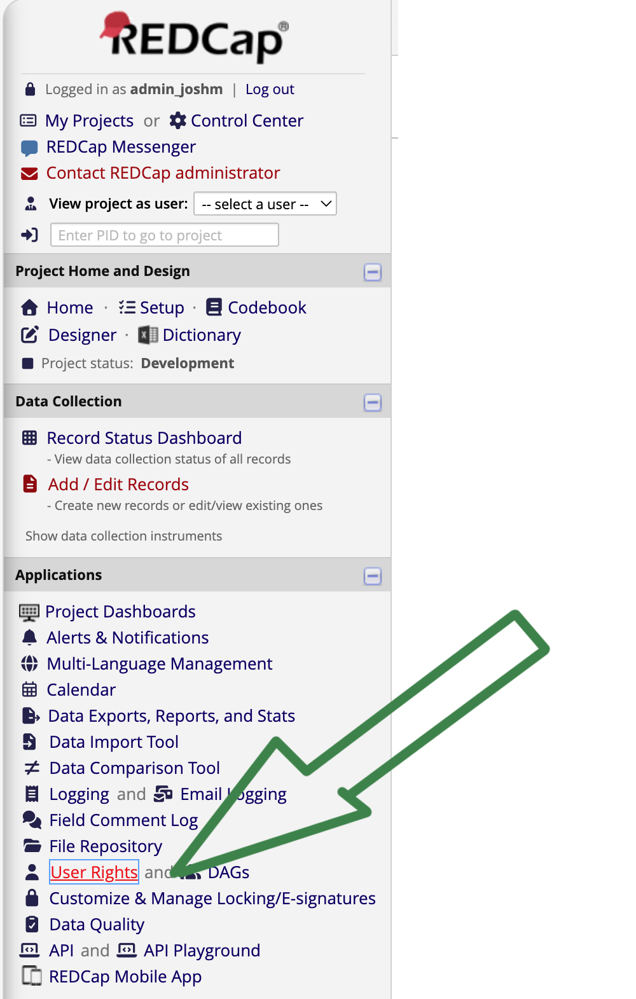
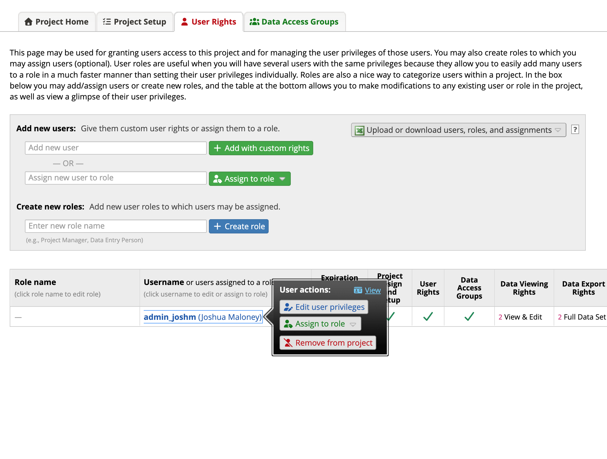
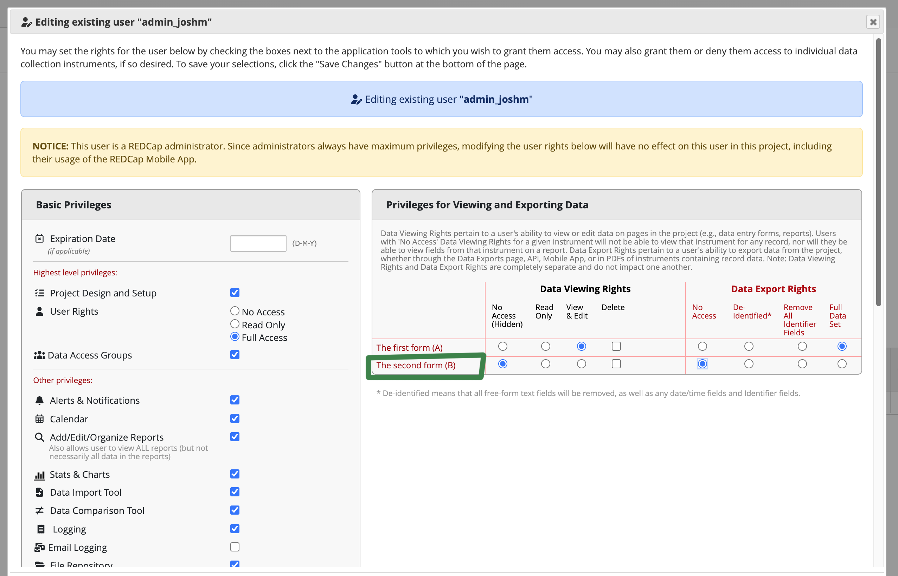
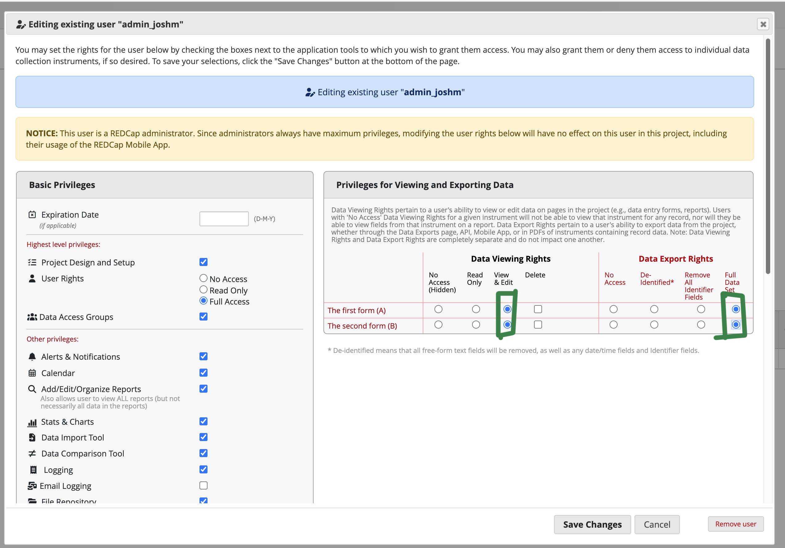

To make a form accessible to users
 ----

Go to your project. Go to User Rights.

 ----
|   |
| ---- | 
 ----

Select the account that you want to change. 

|   |
| ---- | 
 ----

Find the new form that needs to be accessible. 

|   |
| ---- | 
 ----

Make sure that the access permissions are set so that the user can access the form. This needs to be done for each user account. 

|   |
| ---- | 

 ----
 