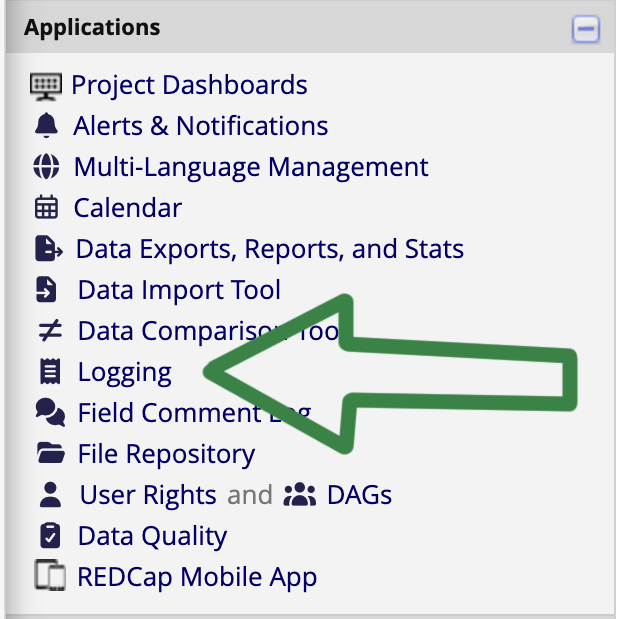
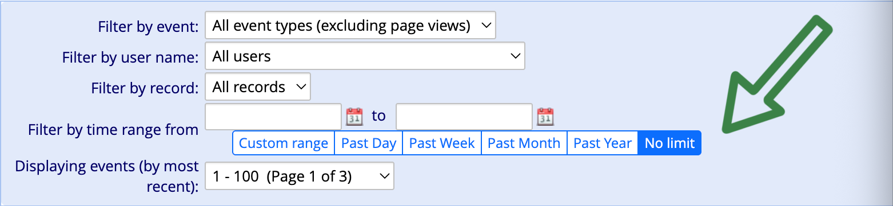

# Recovering lost data from the survey logs

## Go to your project and select Logging from the left menu

|   |

## Change the time range to show all the logs for the project

|   |

## Check the logs

Every participant entry will be logged in chronological order. 

You will have to manually check for updates, if any data fields are entered and updated after the fact. 
